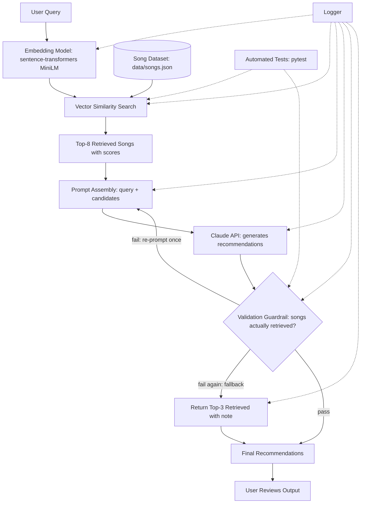

# 🎵 RAG-Based Music Recommender

## 1. Title and Summary

**RAG-Based Music Recommender** is a command-line application that takes a natural-language music request (e.g. *"chill instrumental music for studying"*) and returns 3 recommended songs with explanations, generated by Claude but grounded entirely in a local song dataset. Rather than letting the LLM recommend anything it wants, the system first retrieves the most relevant songs from the catalog via embedding search, and a validation guardrail then checks the model's picks against that retrieved set — rejecting, re-prompting, or falling back on any song the model didn't actually retrieve. The point is to make hallucination structurally hard: the model can only recommend music that provably exists in the dataset it was shown.

## 2. Original Project

This project evolved from **Music Recommender Simulation**, a CodePath AI110 Module 1–3 assignment. The original was a rule-based (non-AI) CLI recommender: it represented songs and a user "taste profile" as plain data (genre, mood, energy, valence, acousticness), scored each song against a profile with a hand-tuned weighted formula (e.g. `2.0*genre_match + 2.0*energy_sim + ...`), and ranked the top matches — no embeddings, no LLM calls, no retrieval. The assignment's goal was to practice representing data, designing a scoring rule, and reflecting on the limitations and biases of a simple content-based recommender (documented in this repo's `model_card.md` under the earlier "Sad Pop" model). This RAG-based version keeps the same underlying idea — recommend songs from a catalog based on a target — but replaces the hand-written scoring formula with real embedding-based retrieval and an LLM-driven generation + guardrail pipeline.

## 3. Architecture Overview

A user query is embedded and matched against pre-embedded song vectors to retrieve the top-8 candidates from the catalog. Those candidates are assembled into a prompt and sent to the Claude API, which picks and explains its top choices. A validation guardrail then checks that every recommended song actually came from the retrieved set — re-prompting once on failure, and falling back to the raw top-3 retrieved songs if that still doesn't pass — before the final recommendations are shown to the user.



The same diagram lives in [`diagrams/architecture.mmd`](diagrams/architecture.mmd).

**Diagram nodes → source files:**

- Embedding Model, Vector Similarity Search, Top-8 Retrieved Songs → `src/retriever.py` (`SongRetriever`)
- Song Dataset → `data/songs.json`
- Prompt Assembly, Claude API → `src/recommender.py` (`Recommender`, `MODEL_NAME = "claude-sonnet-4-6"`)
- Validation Guardrail, Return Top-3 Retrieved (fallback) → `src/validator.py` (`validate_recommendations`, `fallback_recommendations`)
- Final Recommendations, User Reviews Output → `main.py`
- Logger → `src/logging_config.py`, used throughout `retriever.py`, `recommender.py`, and `validator.py`
- Automated Tests → `tests/test_retriever.py`, `tests/test_validator.py`

## 4. Setup Instructions

Assumes a clean macOS machine with Python 3.11+ installed.

1. Clone the repository:

   ```bash
   git clone https://github.com/jienzheng/applied-ai-system-project-music-recommendation.git
   cd applied-ai-system-project-music-recommendation
   ```

2. Create a virtual environment:

   ```bash
   python3 -m venv .venv
   ```

3. Activate the virtual environment:

   ```bash
   source .venv/bin/activate
   ```

4. Install dependencies:

   ```bash
   pip install -r requirements.txt
   ```

5. Copy the environment file template:

   ```bash
   cp .env.example .env
   ```

6. Open `.env` and set your key:

   ```dotenv
   ANTHROPIC_API_KEY=your-actual-key-here
   ```

7. Run the app:

   ```bash
   python main.py
   ```

8. At the `>` prompt, type a natural-language request (e.g. `chill instrumental music for studying`). Type `quit` to exit. The first run downloads the `all-MiniLM-L6-v2` embedding model, which takes a few seconds.

9. Run the test suite:

   ```bash
   pytest
   ```

   Tests mock the Anthropic API and the embedding model, so they run without an API key or network access.

## 5. Sample Interactions

> The three examples below are placeholders — run the app yourself and paste the real output before submitting.

### Example 1

- **Query:** `[FILL IN: Run python main.py, paste an actual query here]`
- **Retrieved candidates (summary):** `[FILL IN: Run python main.py, paste the real retrieved candidates/log output here]`
- **Final output:** `[FILL IN: Run python main.py, paste the real recommendation output here]`

### Example 2

- **Query:** `[FILL IN: Run python main.py, paste an actual query here]`
- **Retrieved candidates (summary):** `[FILL IN: Run python main.py, paste the real retrieved candidates/log output here]`
- **Final output:** `[FILL IN: Run python main.py, paste the real recommendation output here]`

### Example 3

- **Query:** `[FILL IN: Run python main.py, paste an actual query here]`
- **Retrieved candidates (summary):** `[FILL IN: Run python main.py, paste the real retrieved candidates/log output here]`
- **Final output:** `[FILL IN: Run python main.py, paste the real recommendation output here]`

## 6. Design Decisions

**Why RAG over a pure LLM call.** Asking Claude to just "recommend some songs" from its own knowledge would produce plausible-sounding but unverifiable answers — no guarantee the song exists, matches the catalog's tone, or is even real. Retrieval-augmented generation constrains the model to a fixed candidate set built from `data/songs.json`, and the validator in `src/validator.py` enforces that constraint mechanically (exact title+artist match) rather than trusting the model's word for it.

**Why sentence-transformers + numpy cosine similarity instead of a vector database.** `src/retriever.py` embeds the entire ~100-song catalog in memory at startup (`SongRetriever.__init__`) and scores a query with a single matrix-vector dot product (`self.embeddings @ query_embedding`). At this scale, that's a few milliseconds of compute and no infrastructure to run or maintain. A dedicated vector DB (Pinecone, Weaviate, pgvector, etc.) adds real value once the catalog is large enough that brute-force search is too slow, or once the index needs to persist across process restarts or be queried by multiple services — none of which applies here.

**Why the guardrail re-prompts once before falling back.** `Recommender.recommend()` treats a failed validation as likely correctable: the model probably just needs to be told, explicitly, that it invented a song, and one retry with a correction message (`_build_user_message(..., correction=...)`) is cheap and usually fixes it. But retrying indefinitely risks looping on a model that's consistently confused, burns API calls, and delays the user. A single retry followed by a deterministic fallback (`fallback_recommendations`, returning the top-3 retrieved songs) guarantees the app always returns *something* trustworthy, bounded to two model calls per query.

**Why CLI-only, no web framework.** The interaction is a single turn — type a request, get 3 songs back — which a `while True: input()` loop in `main.py` handles completely. A web framework (Flask/FastAPI) would add routing, request/response handling, and a frontend to build and maintain, none of which changes the core retrieval/generation/validation logic being demonstrated.

**Trade-offs, stated plainly:**

- The in-memory embedding index does not scale past roughly a few thousand songs — it re-embeds and re-indexes on every process start, and holds all vectors in RAM with no persistence or incremental updates.
- There is no persistent vector store: restart the app and the entire catalog is re-embedded from scratch. For ~100 songs this costs a few seconds; for a much larger catalog it would not be viable.
- Validation does one retry, not iterative refinement — there's no loop that keeps nudging the model with increasingly specific feedback, so a model that fails twice in a row always falls back to plain retrieval results rather than a generated explanation.
- The guardrail matches on exact (case-insensitive) title + artist strings. A model response with a typo, alternate spelling, or slightly reworded title would be rejected as "hallucinated" even if it meant the right song.

## 7. Testing Summary

`tests/test_retriever.py` patches `SentenceTransformer` with a deterministic bag-of-words fake (`FakeSentenceTransformer`) so tests run without downloading a real model or hitting the network. It covers:

- `retrieve()` returns exactly `k` results, each a `(dict, float)` pair.
- A query that shares vocabulary with jazz-tagged songs ranks those songs higher than an unrelated metal song (`test_relevant_genre_ranks_higher`) — i.e., retrieval actually discriminates on content, not just returning things in dataset order.
- Calling `retrieve()` without an explicit `k` falls back to `DEFAULT_TOP_K` (capped by the number of songs available).

`tests/test_validator.py` covers the guardrail logic directly against a small hard-coded candidate list, with no API calls involved:

- Valid songs (matched on title + artist, case-insensitively) are accepted and merged with the original candidate data (`test_accepts_valid_songs`).
- A song not present in the candidate list is rejected and reported as invalid (`test_rejects_hallucinated_songs`).
- A title that matches but an artist that doesn't is also rejected (`test_rejects_song_with_mismatched_artist`) — confirming the match requires *both* fields, not just the title.
- `fallback_recommendations()` returns the requested number of top candidates, each annotated with a non-empty fallback reason (`test_fallback_returns_top_k_candidates_with_reason`).

All 7 tests pass as of this writing (`pytest` run under Python 3.11).

`[FILL IN: any bugs you hit, edge cases that failed, things you'd test further]`

## 8. Reflection

Building this made the practical value of RAG concrete in a way that's easy to state abstractly but hard to appreciate otherwise: an LLM given a fixed, verifiable candidate set is a fundamentally different (and much safer) system than an LLM given an open-ended question, because you can *check* its answer against ground truth instead of just trusting fluency. The validation guardrail was the most instructive piece to build — it forced me to think about failure as a first-class case rather than an afterthought: what happens when the model doesn't listen the first time, how many retries are worth paying for, and what a safe, deterministic fallback looks like when generation just doesn't cooperate. More generally, this reinforced that "AI-powered" features are best thought of as pipelines with a model embedded in them, not as models you point at a problem and trust — the retrieval step, the prompt assembly, and the guardrail are doing as much of the real work here as the LLM call itself.

The graded responsible-AI reflection — collaboration process, one helpful and one flawed AI suggestion, and system limitations — is in `model_card.md`, not here.
