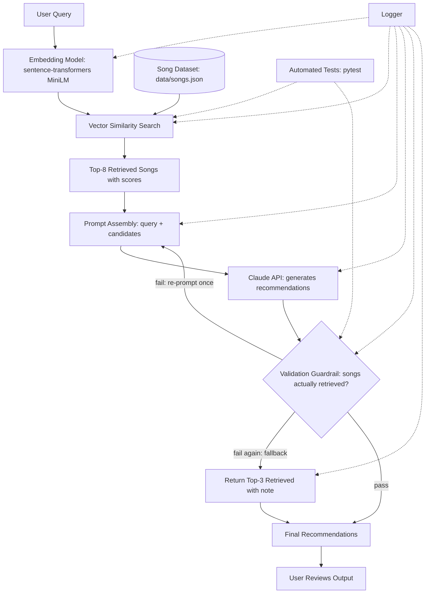

# 🎵 RAG-Based Music Recommender

## Project Overview

A CLI application that takes a natural-language music request (e.g. *"chill instrumental music for studying"*) and returns 3 recommended songs with explanations. Recommendations are **grounded in retrieval**: the LLM is only ever allowed to recommend songs that were actually retrieved from the local dataset, and a validation guardrail enforces this — rejecting or re-prompting on any hallucinated song, and falling back to raw retrieval results if the model can't be corrected.

## Architecture Summary

1. **Dataset** (`data/songs.json`) — ~100 real, well-known songs across rock, pop, jazz, classical, hip-hop, electronic, lo-fi, country, R&B, and metal. Each entry has title, artist, genre, mood tags, tempo, an instrumental flag, and a short description.
2. **Retrieval** (`src/retriever.py`) — embeds each song's combined metadata using `sentence-transformers` (`all-MiniLM-L6-v2`), builds an in-memory index at startup, and retrieves the top-8 candidates for a query via cosine similarity (numpy).
3. **Generation** (`src/recommender.py`) — sends the user query and the 8 retrieved candidates to the Anthropic API (`claude-sonnet-4-6`), asking it to pick the best 3 from *only* the provided list and explain each choice, as JSON.
4. **Guardrail** (`src/validator.py`) — verifies every recommended song exists in the retrieved candidate set (matched on title + artist). On failure, the app re-prompts the model once with a correction; if that still fails, it falls back to the top-3 retrieved songs with a note. All validation failures are logged.
5. **Logging** (`src/logging_config.py`) — logs to console (INFO+) and `logs/app.log` (DEBUG+): every query, retrieved candidates with similarity scores, raw model responses, validation results, and errors.

## System Architecture

A user query is embedded and matched against pre-embedded song vectors to retrieve the top-8 candidates; those candidates are assembled into a prompt and sent to the Claude API, which picks and explains its top choices. A validation guardrail then checks that every recommended song actually came from the retrieved set — re-prompting once on failure and falling back to the raw top-3 retrieved songs if that still doesn't pass — before the final recommendations are shown to the user.



The same diagram lives in [`diagrams/architecture.mmd`](diagrams/architecture.mmd).

**Diagram nodes → source files:**

- Embedding Model, Vector Similarity Search, Top-8 Retrieved Songs → `src/retriever.py`
- Song Dataset → `data/songs.json`
- Prompt Assembly, Claude API → `src/recommender.py`
- Validation Guardrail, Return Top-3 Retrieved (fallback) → `src/validator.py`
- Final Recommendations, User Reviews Output → `main.py`
- Logger → `src/logging_config.py`, used throughout `retriever.py`, `recommender.py`, and `validator.py`
- Automated Tests → `tests/test_retriever.py`, `tests/test_validator.py`

## Setup

Requires Python 3.11+.

1. Create and activate a virtual environment:

   ```bash
   python3 -m venv .venv
   source .venv/bin/activate      # Mac or Linux
   .venv\Scripts\activate         # Windows
   ```

2. Install dependencies:

   ```bash
   pip install -r requirements.txt
   ```

3. Configure your API key:

   ```bash
   cp .env.example .env
   # then edit .env and set ANTHROPIC_API_KEY=<your key>
   ```

## Running the App

```bash
python main.py
```

Type a request like `chill instrumental music for studying`, and type `quit` to exit. The first run downloads the `all-MiniLM-L6-v2` embedding model, which takes a few seconds.

## Running Tests

Tests mock the Anthropic API and the embedding model, so they run without a key or network access:

```bash
pytest
```

- `tests/test_validator.py` — the guardrail accepts valid songs, rejects hallucinated ones, and the fallback path works.
- `tests/test_retriever.py` — retrieval returns `k` results, and a genre relevant to the query ranks higher than an unrelated one.

## Logs

Every query, its retrieved candidates (with similarity scores), the raw model response, validation outcome, and any errors are written to `logs/app.log` (not tracked in git).
